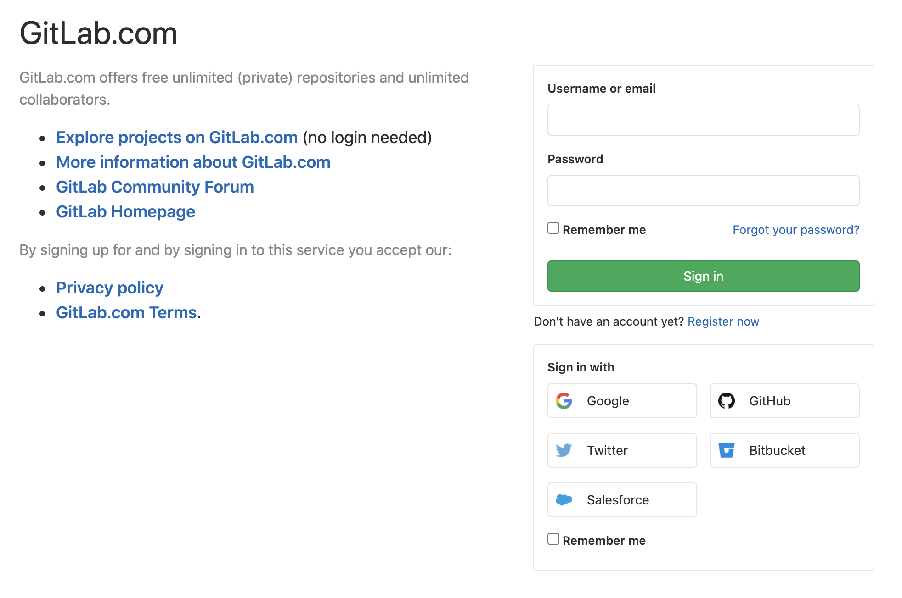
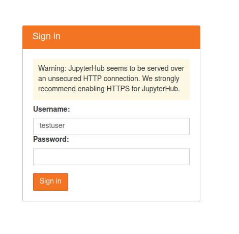
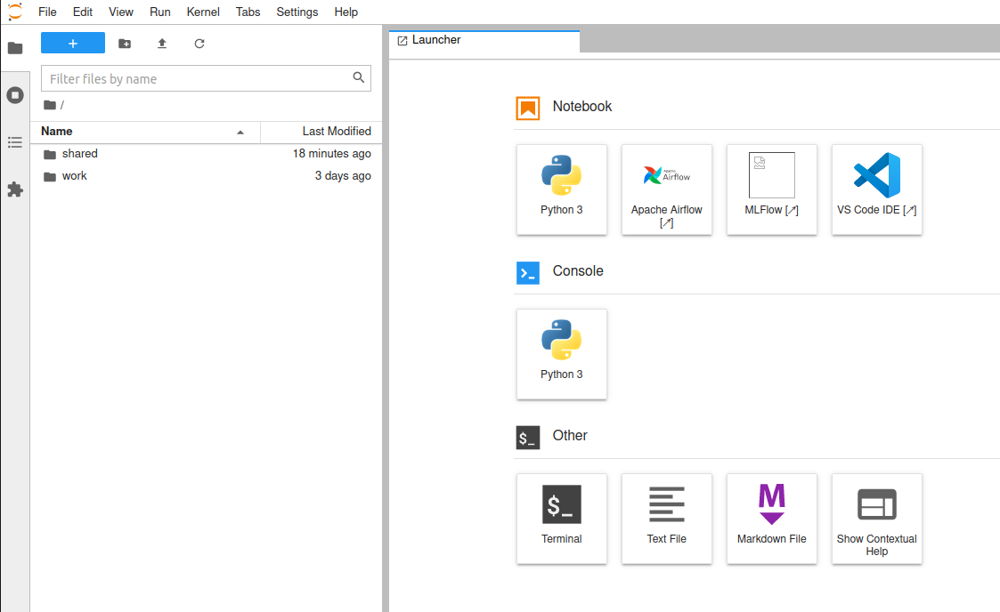
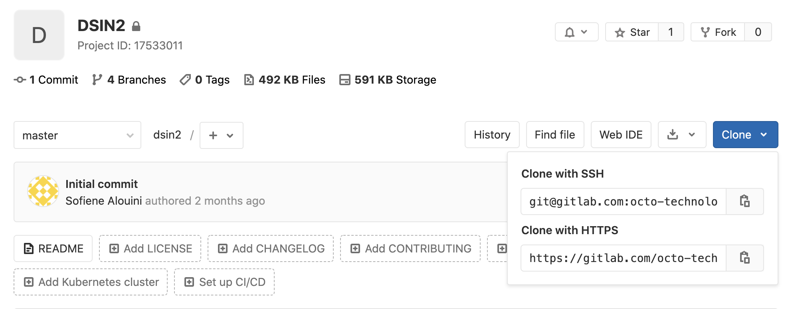

summary: TP0 - Setup de l'environnement de travail
id: tp0
categories: setup
tags: setup
status: Published
authors: OCTO Technology
Feedback Link: https://gitlab.com/octo-technology/les-bg-de-la-data/s-s-all/formation/dsin2/-/issues/new

# TP0 - Préparation de l'environnement de travail

## Vue d'ensemble
Durée : 15 min

Cette partie permet de préparer l'environnement de travail pour les TPs.

## Créer un compte sur Gitlab
Durée : 2 min

### Création du compte

Rendez-vous sur le site de Gitlab afin de créer un compte si vous n'en possédez pas déjà un : <https://gitlab.com/users/sign_in>.

Puis, cliquez sur `Register now`:



### Fork du repo de TP dans votre espace personnel gitlab

Une fois votre compte créé, rendez-vous sur la page du repository de code de cette formation : <https://gitlab.com/mhouacine/dsin2>

Puis `forkez` le repo à l'aide du bouton en haut à droite pour récupérer une copie de ce dernier dans votre espace Gitlab personnel :


🏁 Vous possédez désormais une copie personnelle du repository de code pour les TPs ! Nous allons désormais la cloner dans votre environnement de développement.

## Prise en main de jupyterhub l'environnement de tp.
Durée : 3 min

Pour vous connecter sur l'interface de TP, l'instructeur vous aura donné votre identifiant/mot de passe :


Une fois connecté, une page de chargement apparaît, temps pendant lequel votre environnement de TP est créé : 


Cela peut prendre 1 à 2 minutes, mais pas plus. Si votre environment ne démarre pas vous pouvez essayer d'actualiser puis faire appel à votre formateur.

Une fois que le serveur est démarré vous êtes redirigé vers la page principale :


Depuis cette page vous pouvez ouvrir :
- Un terminal : dans other / terminal
- Un éditeur de code en ligne : dans Notebook / VS Code
- Airflow et MLFlow que nous manipulerons


## Préparer son environnement et cloner le repo
Durée : 3min

Rendez-vous sur votre environnement de développement.

L'URL de ce dernier vous sera communiqué pendant la formation.

Dans VSCode, ouvrez un terminal afin d'y cloner le repository de code des TPs avec la commande `$> git clone <url>;`. Vous trouverez l'URL de clonage en HTTPS sur gitlab, dans le repo que vous avez forké :

Pour ouvrir un terminal il faut cliquer sur les 2 barres parallèles en haut à droite puis `terminal` puis `new terminal`. 


Pour réaliser ce TP vous devant ensuite checkout la branche `0_initial_state` :

```bash
cd dsin2
git checkout 0_initial_state
```

Ensuite, nous allons créer un environnement de travail Python avec Conda et installer les dépendances :

```bash
conda create -yqf python=3.9 --name python_indus_avancee
source activate python_indus_avancee
pip install -e .
pip install -r requirements_test.txt
```

Exécutons les tests pour s'assurer que tout fonctionne !

```bash
make tests-unitaires
```


