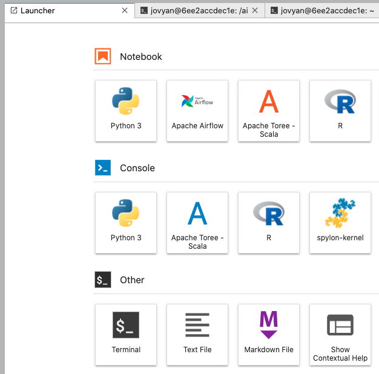

summary: TP4
id: tp4
categories: tp, api
tags: api, flask
status: Published
authors: OCTO Technology
Feedback Link: https://gitlab.com/octo-technology/les-bg-de-la-data/s-s-all/formation/dsin2/-/issues/new

# TP4 - Orchestration

## Overview
Duration: 60

### A l'issue de cette section, vous aurez découvert

- Découvrir l'orchestration avec Airflow,
- Savoir créer un `DAG` et les scheduler,
- Savoir créer des `tasks` Airflow et les orchestrer,
- Comprendre la gestion des `IO` avec Airflow.

### Présentation des nouveautés sur la branche de ce TP

Pour ce TP, utiliser la branch 4_starting_orchestration

`git checkout 4_starting_orchestration`

Sur cette branche, il y a maintenant : 
- Un DAG `dags/train.py` qui permet d'entraîner un modèle
- Un DAG `dags/predict.py` qui est incomplet et qui permettra de réaliser des prédictions
- Les fonctions existantes dans `formation_indus_avancee/` ont été décoré avec des `read` et des `write` pour donner des 
fonctions `function_name_with_io`
 

## Scripts à disposition

Le dossier `dsin2/scripts` contient des scripts d'entraînement et de prédiction pour notre cas d'usage de Machine Learning.

Nous allons désormais voir comment orchestrer ces tâches grâce à `Airflow`.

## Revue de code avec les formateurs

Revue de code avec les formateurs pour introduire les concepts de DAGs et de tâches dans le code.

### Gestion des IO

Il n'est pas conseillé de passer de la donnée d'une tâche à l'autre dans un DAG Airflow.

Pour répondre à ce problème, nous avons décoré la fonction de prédiction avec

- une fonction permettant de lire un fichier en entrée,
- et d'écrire le résultat de la tâche dans un fichier en sortie.

A l'image des fonctions `train_with_io` et `train` du module `train_and_predict.py` dans `/formation_indus_ds_avancee`, nous avons créé une fonction `predict_with_io` qui soit utilisable par le DAG Airflow.

Les prédictions réalisées sont écrites dans 2 fichiers identiques:

- {date}.csv où la date est au format `%Y%m%d-%H%M%S`, exemple:
- latest.csv

## Démarrer avec Airflow

- Modifier le fichier `/airflow/airflow.cfg` avec l'éditeur `nano /airflow/airflow.cfg`:
  - Changer la variable `dags_folder` pour pointer sur `/home/jovyan/dsin2/dags`, cela permet d'indiquer à airflow où se situent vos DAGs

```toml
# Fichier /airflow/airflow.cfg
[core]
# The folder where your airflow pipelines live, most likely a
# subfolder in a code repository
# This path must be absolute
dags_folder = /airflow/dags

...

# Whether to load the examples that ship with Airflow.
load_examples = True

...

# How often (in seconds) to scan the DAGs directory for new files. Default to 5 minutes.
dag_dir_list_interval = 300
```

- Dans le `Launcher`, lancer le service `Airflow`.



L'interface graphique d'Airflow devrait s'ouvrir dans un nouveau onglet.

- En ligne de commande dans un terminal que vous ne devez pas fermer, lancer le scheduler avec `airflow scheduler`.

L'interface graphique devrait désormais afficher 3 dags:


## Lancer un premier DAG d'entraînement

Afin de s'entraîner, il va nous falloir des données d'entraînement !

Elles ne sont pas versionnées dans ce repo. Télécharger les données avec la commande `make dataset`.

Les données sont désormais disponible dans `dsin2/data/la-haute-borne-data-2017-2020.csv`.

Airflow tourne en utilisant l'env `base` de python. Il faut donc installer notre librairie 

- Installer le package en ouvrant un nouveau terminal, `cd dsin2; pip install .`

Pour lancer le dag `train`:

- activer le DAG en appuyant sur le bouton `ON/OFF` (à gauche),
- déclencher le DAG manuellement en cliquant sur `Trigger Dag` dans les links (l'icône play)  (sur la droite).


Inspecter le dag `train` en cliquant sur celui-ci, la tâche `prepare_features` devrait avoir commencé:


## DAG de prédiction

Compléter le DAG `dags/predict` pour intégrer la fonction `predict_with_io` dans un opérateur, avec les bons arguments.


## Pour aller plus loin
Pour aller plus loin en attendant les autres formés vous pouvez rearder comment utiliser les fichiers géénrés par le dag `get_data_from_engie_hub.py` dans le dag `predict`. 
