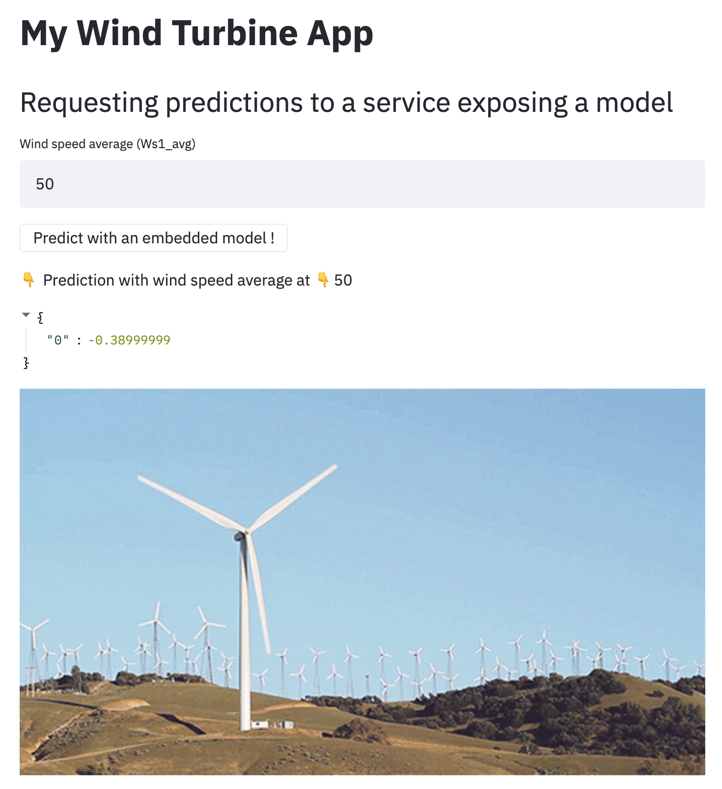
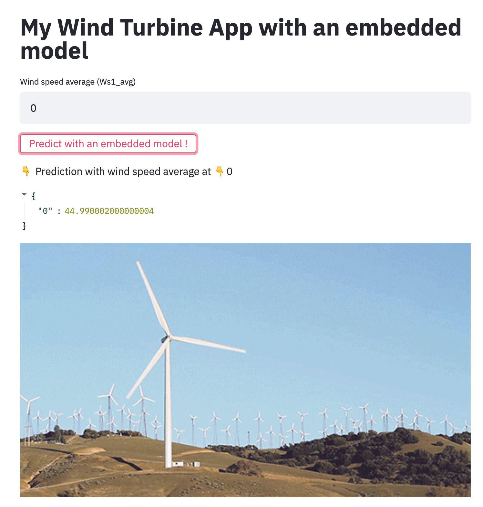

summary: TP7 - Exposition de modèles
id: tp7
categories: tp, api
tags: api, flask
status: Published
authors: OCTO Technology
Feedback Link: https://gitlab.com/octo-technology/les-bg-de-la-data/s-s-all/formation/dsin2/-/issues/new

# TP7 - Exposition de modèles

## Vue d'ensemble
Durée : 30 min

### À l'issue de cette section, vous aurez découvert

- Comment fonctionne une simple API Flask,
- Le pattern d'exposition `embedded model`,
- Le pattern d'exposition `model as a service`,
- Le pattern d'exposition `model published as data`,

### Présentation des nouveautés sur la branche de ce TP

Pour ce TP, utilisez la branch 7_starting_exposition

`git checkout 7_starting_exposition`

Sur cette branche, il y a maintenant : 
- Un dossier exposition qui contient trois formats d'exposition
- `embedded_model` une app Streamlit qui permet de demander des prédictions
- `exposing_predictions` une app Streamlit qui permet de voir les prédictions réalisées précédemment
- `model_as_a_service` une API Flask qui permet de demander des prédictions 

## Développement d'API avec Flask

Flask est un microserveur d'application. Il est souvent utilisé en Python pour développer des APIs et exposer des ressources.

### Lancer l'API et requêter la route health

- Se rendre dans `dsin2-public-ocac/exposition/model_as_a_service/`
- Démarrer le serveur Flask d'exposition avec `FLASK_APP=inference.py python -m flask run`

⚠ Le serveur Flask ne sera pas consultable dans votre navigateur !

Le serveur d'exposition est désormais disponible sur le port 5000 <http://localhost:5000>, avec :
 - la route de healthcheck `/health` pour vérifier que le service est fonctionnel,
 - la route predict `/predict` pour obtenir des prédictions

Dans votre terminal, avec l'outil en ligne de commande `cURL`, requêtez l'URL de `healthcheck` du service pour s'assurer qu'il fonctionne (<http://localhost:5000/health>).


### Implémenter la route predict

La route `predict` n'est actuellement pas implémentée. 

Codez le contenu de cette route.

Quelques informations relatives à la construction de route d'API :  
  - Pour passer un argument dans l'appel à la route, ajoutez `?arg_name=value` à la route (exemple : <http://localhost:5000/predict?Ws1_avg=10>)
  - Pour récupérer la valeur d'un argument dans le code, utilisez `request.args.get('argument_name')` (exemple : `received_wind_speed_avg = request.args.get('Ws1_avg')`)
  - Pour retourner un résultat dans une API flask, utilisez `jsonify` (exemple : `jsonify(prediction)`)  

Comme le modèle prend de nombreuses variables en entrée, pour simplifier le TP nous vous proposons de ne passer que 1 ou 2 arguments à la route d'API et fixer les autres par défaut. Pour cela voici un code qui créé un `dataframe` avec des valeurs par défaut pour toutes les variables : 

```python
received_data_df = pd.DataFrame(
        {"Wind_turbine_name": "R80721", "Date_time": "2017-02-08T08:00:00+01:00", "Ba_avg": 44.99, "Ba_min": 44.99,
         "Ba_max": 44.99, "Ba_std": 0.0, "Rt_avg": 14.0, "Rt_min": 14.0, "Rt_max": 14.0, "Rt_std": 0.0,
         "DCs_avg": 38.36, "DCs_min": 17.68, "DCs_max": 52.41, "DCs_std": 9.39, "Cm_avg": 2.39, "Cm_min": 2.05,
         "Cm_max": 2.69, "Cm_std": 0.09, "P_avg": -1.89, "P_min": -2.35, "P_max": -1.4, "P_std": 0.15, "Q_avg": 0.0,
         "Q_min": 0.0, "Q_max": 0.0, "Q_std": 0.0, "S_avg": 1.89, "S_min": 1.4, "S_max": 2.35, "S_std": 0.15,
         "Cosphi_avg": 1.0, "Cosphi_min": 1.0, "Cosphi_max": 1.0, "Cosphi_std": 0.0, "Ds_avg": 38.11, "Ds_min": 17.27,
         "Ds_max": 51.91, "Ds_std": 9.39, "Db1t_avg": 33.41, "Db1t_min": 33.20, "Db1t_max": 33.59, "Db1t_std": 0.14,
         "Db2t_avg": 30.79, "Db2t_min": 30.6, "Db2t_max": 30.85, "Db2t_std": 0.02, "Dst_avg": 45.59, "Dst_min": 45.29,
         "Dst_max": 45.79, "Dst_std": 0.11, "Gb1t_avg": 35.36, "Gb1t_min": 35.09, "Gb1t_max": 35.5, "Gb1t_std": 0.15,
         "Gb2t_avg": 37.93, "Gb2t_min": 37.79, "Gb2t_max": 38.0, "Gb2t_std": 0.07, "Git_avg": 34.13, "Git_min": 31.79,
         "Git_max": 35.70, "Git_std": 1.04, "Gost_avg": 39.58, "Gost_min": 39.04, "Gost_max": 40.20, "Gost_std": 0.4,
         "Ya_avg": 318.12, "Ya_min": 318.12, "Ya_max": 318.12, "Ya_std": 0.0, "Yt_avg": 20.61, "Yt_min": 20.5,
         "Yt_max": 20.79, "Yt_std": 0.07, "Ws1_avg": 4.5, "Ws1_min": 0.0, "Ws1_max": 1.94, "Ws1_std": 0.44,
         "Ws2_avg": 0.22, "Ws2_min": 0.0, "Ws2_max": 1.92, "Ws2_std": 0.52, "Ws_avg": 0.18, "Ws_min": 0.0,
         "Ws_max": 1.89, "Ws_std": 0.44, "Wa_avg": 358.04, "Wa_min": 298.76, "Wa_max": 54.56, "Wa_std": 12.05,
         "Va1_avg": None, "Va1_min": None, "Va1_max": None, "Va1_std": None, "Va2_avg": None, "Va2_min": None,
         "Va2_max": None, "Va2_std": None, "Va_avg": 39.93, "Va_min": -19.35, "Va_max": 96.44, "Va_std": 12.05,
         "Ot_avg": 4.80, "Ot_min": 4.8, "Ot_max": 4.90, "Ot_std": 0.009, "Nf_avg": 50.0, "Nf_min": 49.95,
         "Nf_max": 50.02, "Nf_std": 0.00, "Nu_avg": 698.40, "Nu_min": 696.01, "Nu_max": 708.03, "Nu_std": 2.40,
         "Rs_avg": 0.33, "Rs_min": 0.0, "Rs_max": 0.49, "Rs_std": 0.16, "Rbt_avg": 19.02, "Rbt_min": 19.0,
         "Rbt_max": 19.1, "Rbt_std": 0.03, "Rm_avg": -18.88, "Rm_min": -438.32, "Rm_max": 0.0, "Rm_std": 79.82,
         "Pas_avg": None, "Pas_min": None, "Pas_max": None, "Pas_std": None, "Wa_c_avg": 358.04, "Wa_c_min": None,
         "Wa_c_max": None, "Wa_c_std": None, "Na_c_avg": 358.04, "Na_c_min": None, "Na_c_max": None, "Na_c_std": None},
        index=[0])
```

Utilisez les méthodes `prepare_features` et `predict` pour réaliser une prédiction.

Pour tester votre code éteignez l'API et redémarrez-la avec la commande `FLASK_APP=inference.py python -m flask run`  puis requêtez une prédiction sur <http://localhost:5000/predict>.

## Démo: Exposition | model as a service

Dans le dossier `exposition/` se trouvent un fichier `docker-compose.yaml`, exécutable avec `docker-compose up`.

NB : Il n'est pas possible d'exécuter cette commande dans l'environnement de TP. Si vous avez Docker et Docker-compose vous pouvez le faire sur votre machine personnelle. 
Sinon, le formateur a déjà fait cela dans l'EC2 de TP. 

Une fois lancée, l'application Streamlit est accessible sur <http://<machine-ip>:15002> et le service Flask est disponible sur <http://<machine-ip>:15003>.

Dans le dossier `exposition/model_as_a_service/` se trouve la définition de ces 2 services :

- une application de Dashboarding construite avec Streamlit dans `app.py`,
- un service d'inférence construit avec Flask dans `inference.py`.

L'application Streamlit permet d'afficher une prédiction à la demande selon la valeur de `Ws1_avg` spécifiée par l'utilisateur.



- Modifiez la valeur de `Wind Speed Average` à 0, 10, 20, 50, 100 et demander une prédiction
- Observez les logs de docker-compose et constatez que le service Flask réalise les prédictions quand Streamlit les demande.

## Démo: Exposition | embedded model

Dans le dossier `exposition/` se trouve un fichier `docker-compose.yaml`, exécutable avec `docker-compose up`.

NB : Il n'est pas possible d'exécuter cette commande dans l'environnement de TP. Si vous avez Docker et Docker-compose vous pouvez le faire sur votre machine personnelle. 
Sinon, le formateur a déjà fait cela dans l'EC2 de TP. 

Une fois lancée, l'application Streamlit avec modèle embarqué est accessible sur <http://<machine-ip>:15001>.

Dans le dossier `exposition/embedded_model/` se trouve la définition de ce service de Dashboarding :

- une application de Dashboarding construite avec Streamlit dans `embedded_model.py`,
- il n'y a pas de service d'inférence.

L'application Streamlit permet d'afficher une prédiction à la demande selon la valeur de `Ws1_avg` spécifiée par l'utilisateur.



- Modifiez la valeur de `Wind Speed Average` à 0, 10, 20, 50, 100 et demandez une prédiction
- Observez les logs de docker-compose et constatez que le service Flask ne réalise pas de prédictions quand Streamlit les demande.

## Démo: Exposition | Exposing predictions

Dans le dossier `exposition/` se trouve un fichier `docker-compose.yaml`, exécutable avec `docker-compose up`.

NB : Il n'est pas possible d'exécuter cette commande dans l'environnement de TP. Si vous avez Docker et Docker-compose vous pouvez le faire sur votre machine personnelle. 
Sinon, le formateur a déjà fait cela dans l'EC2 de TP. 

Une fois lancée, l'application Streamlit est accessible sur <http://<machine-ip>:15000>.

Dans le dossier `exposition/exposing_predictions/` se trouve la définition de ce service de Dashboarding dans `display_predictions.py`.

L'application Streamlit affiche des prédictions déjà réalisées.


