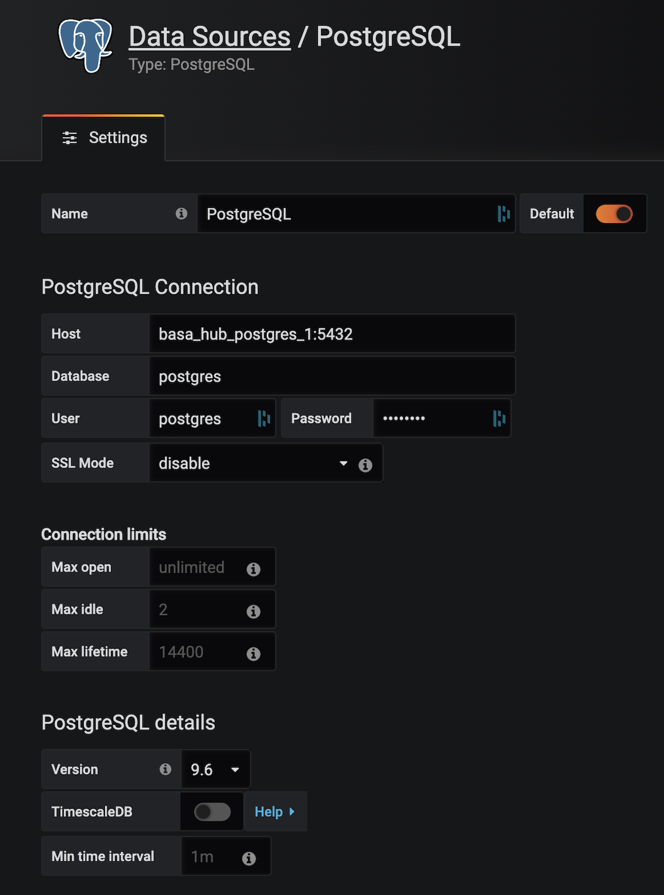

summary: TP8
id: tp8
categories: tp, api
tags: api, flask
status: Published
authors: OCTO Technology
Feedback Link: https://gitlab.com/octo-technology/les-bg-de-la-data/s-s-all/formation/dsin2/-/issues/new

# TP8 - Monitoring

## Overview
Duration: 1

### À l'issue de cette section, vous aurez découvert:

- Comment implémenter une sonde de monitoring de vos prédictions
- Comment créer et alimenter une DB avec les valeurs monitorées
- Comment créer un dashboard de monitoring dans Grafana

### Présentation des nouveautés sur la branche de ce TP

Pour ce TP, utiliser la branch 8_starting_monitoring

`git checkout 8_starting_monitoring`

Sur cette branche, il y a maintenant : 
- Un fichier `formation_indus_ds_avancee/monitoring.py` qui contient 2 fonctions `monitor_with_io` et `monitor`
- Un fichier de tests correspondant : `tests/test_unit/test_monitoring.py` qui test la fonction `monitor_with_io`
- Une tâche en plus dans le dag `dags/predict.py` qui est en charge d'excécuter le monitoring. 

## Monitoring des prédictions et enregistrement dans une DB

- Définir une sonde de monitoring sous forme de fonction Python

Dans le fichier `formation_indus_ds_avancee/monitoring.py`, créer une fonction `monitor` qui retournera la valeur de
votre choix à monitorer. Cette valeur sera enregistrée dans la DB PostreSQL grâce à la fonction `monitor_with_io`
associée à une tâche Airflow.

- Mettre à jour le test unitaire dans `tests/test_unit/test_monitoring.py` pour que il soit vert.

- Spécifier la table postgreSQL dans laquelle enregistrer les valeurs à monitorer

Dans le fichier `dags/config.py`, définir la constante `MONITORING_TABLE_NAME` avec un nom unique
différent de celui des autres participants. Cette table sera désormais alimentée par la tâche `monitor` d'Airflow.

- Relancer Airflow et le DAG de prédiction

La tâche `monitor` devrait s'exécuter. Il nous faut désormais créer un dashboard de suivi des valeurs renvoyées par
notre fonction.

## Affichage d'un dashboard de monitoring dans Grafana

Nous souhaitons maintenant afficher nos valeurs monitorées dans Grafana à partir de la table postgreSQL.

- Accéder à Grafana sur le port `3000` et se connecter avec l'identifiant `admin` et le mot de passe `admin`

- Créer la connexion à la DB postgreSQL

La connexion à définir est la même pour l'ensemble des participants à la formation : cette tâche doit donc être réalisée
en mob programming avec les formateurs.

Nous allons ajouter une *Data Source* de type *postgreSQL* et spécifier les paramètres suivants :

*Note : Dans le cadre du TP, le paramètre `Host` sera communiqué par le formateur.*

- Créer un simple dashboard de monitoring.

Il vous suffit de cliquer sur *New dashboard* > *Add Query*, et de spécifier la connexion et la table postgreSQL
(personnelle) créées lors des étapes précédentes.